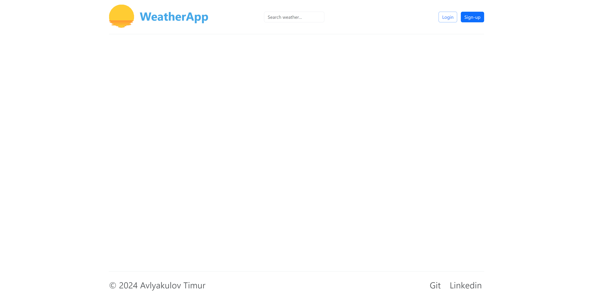
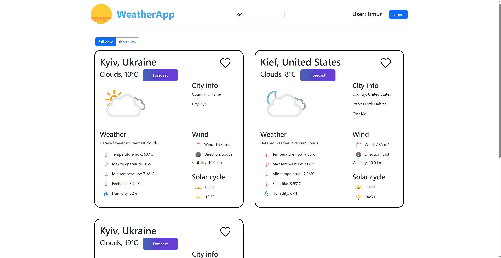

# Weather App

## Description

`Weather App` - It is MVC Java Servlet App with Unit and Integration tests for testing functionality.
It has a view with thymeleaf pages you can check weather any city and and create account for saving locations in DB.

Project from this [course](https://zhukovsd.github.io/java-backend-learning-course/)

## Project Stack

* Servlets
* Java EE
* Session Management
* Docker
* Docker compose
* Postgres, H2
* Slf4j
* Integration testing, JUnit 5, Mockito
* Thymeleaf, HTML, CSS, JS
* Hibernate
* API Weather
* JSON

## Pages of project

### Logged Page

### Main page

### Login page

### Registration page

### Success registration

### Search weather

